---
---
---

# 财务岗位招聘需求分析

## 总述

本次采集有效数据2227条，按高层（总监级），中层（经理或主管级或专业级），基层（会计/出纳）三个层次分析财务岗位招聘需求，数据说明如下：

-   总监级：171条数据，11个维度；
-   经理\|主管级：994条数据，11个维度；
-   专业级：63条数据，11个维度；
-   会计/出纳：587条数据，11个维度；

本次将从如下方面分析招聘市场数据：

-   城市分布 ： 招聘岗位主要分布在江浙、广东、武汉、北京。
-   公司行业 ： 主要集中行业为机械、电子、快消、制药、建筑、汽车。
-   公司规模 : 主要以500人以下公司规模为主，占70%；但千人以上企业更看重财务分析。
-   公司类型 ： 民营企业为最大雇主，占市场招聘需求的73%，对于财务分析岗位，欧美外企占招聘需求的22%，民企占33%。
-   经验学历 ： 学历以大专本科为主，占95%；总监级别，88%的企业要求平均8年相关经验；经理级别，73%的企业要求平均5年相关经验；会计平均经验2.5年（81%）；出纳平均经验1.5年（73%）；财务分析平均经验5年（68%）。
-   任职要求 ： 财务总监主要围绕资金、税务、成本的控制与计划，组织经营和分析预算；财务经理主要围绕核算成本和税务，报表分析，熟悉专业、组织部门；财务分析主要围绕经营报告、成本报表、业务数据和预算、专业度要求高；会计和出纳主要围绕税务、凭证、报表 、熟练使用软件和处理银行、现金等业务。
-   薪酬水平 ： 按月薪，总监级平均24000元，经理级平均12300元，财务分析平均12500元，会计平均6500元，出纳平均5500元。
-   福利待遇 ： 主要为五险一金、奖金补贴、培训、节日福利、假期等。

## 城市分布

## 公司行业

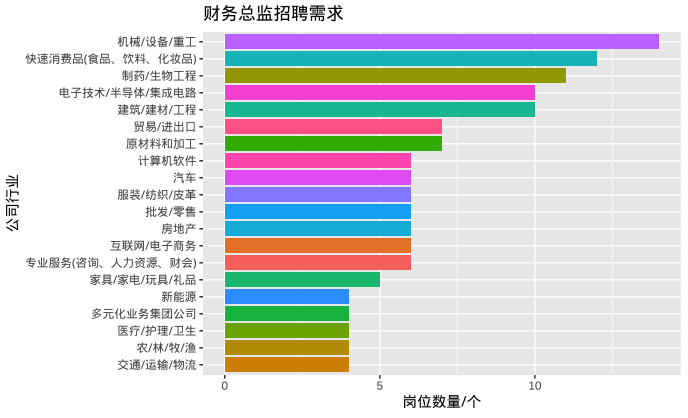

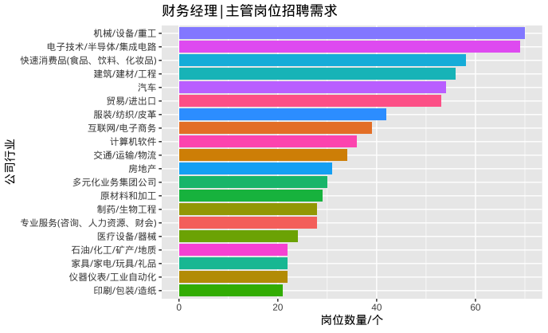

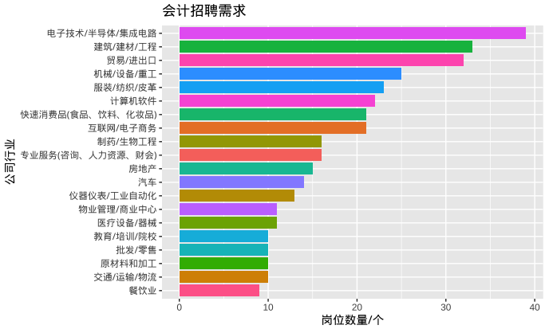

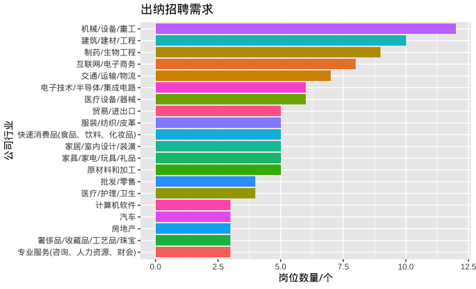

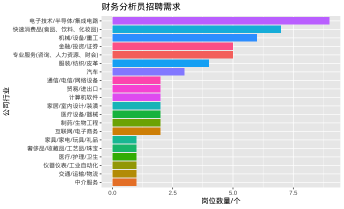

## 公司规模

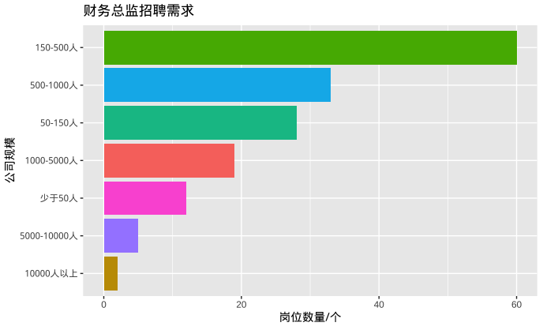

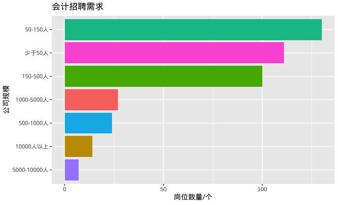

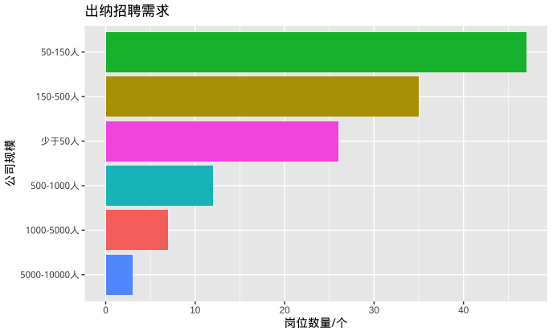

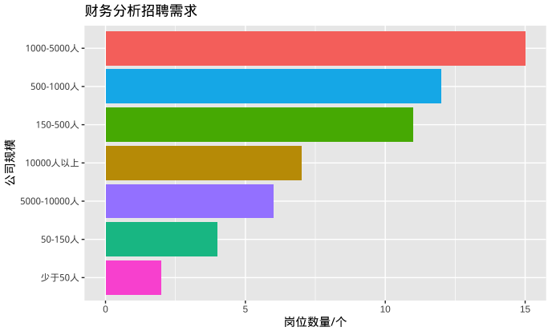

## 公司类型

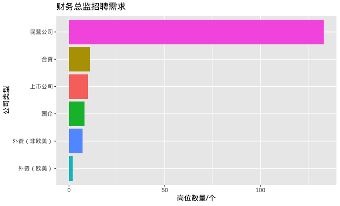

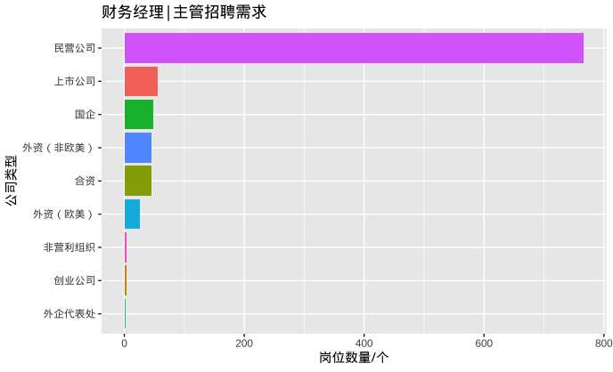

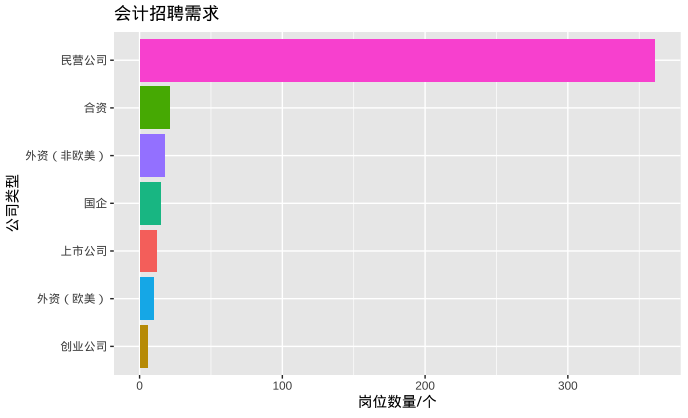

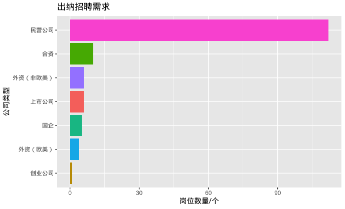

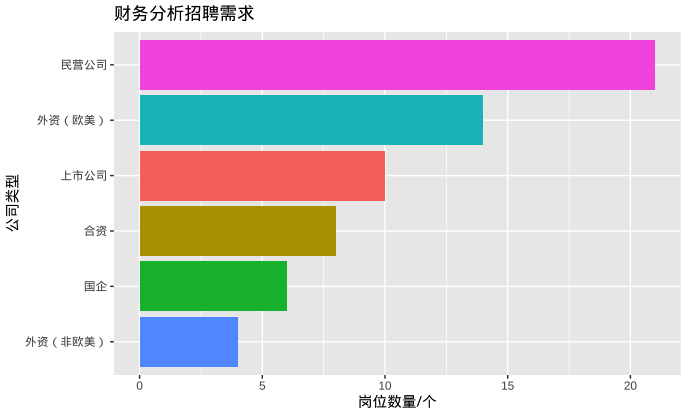

## 经验学历

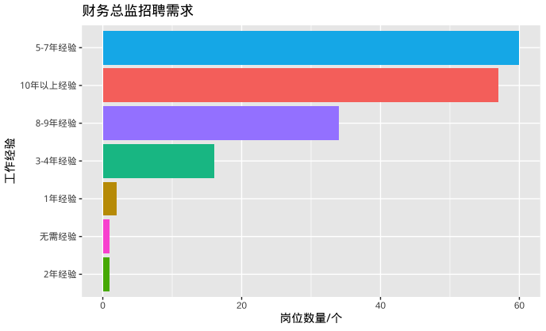

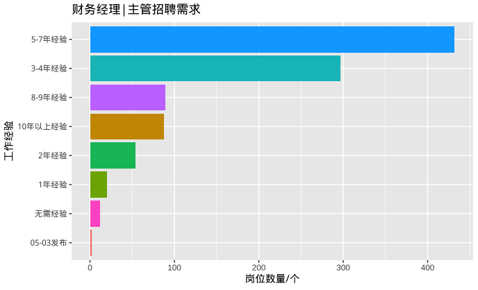

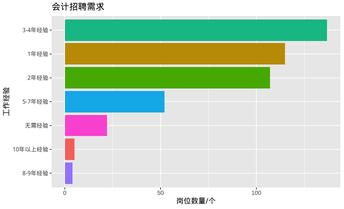

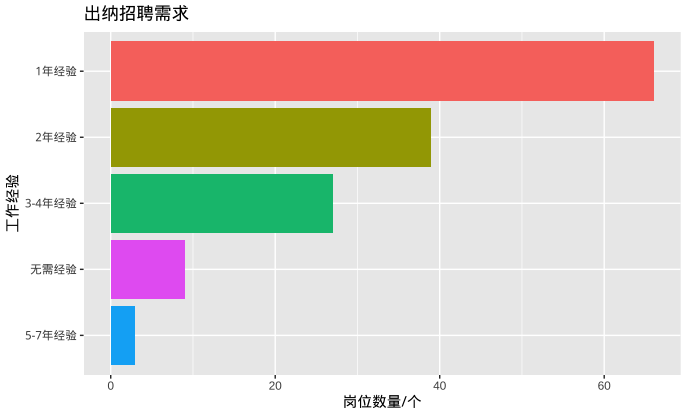

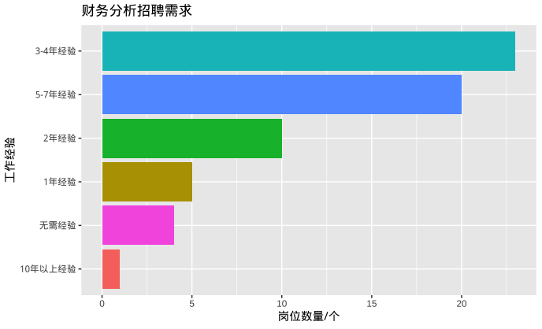

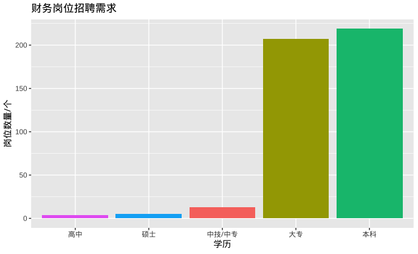

## 任职要求

## 薪酬水平

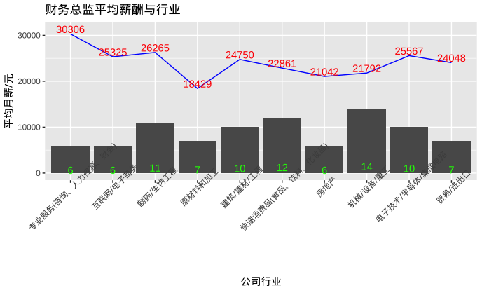

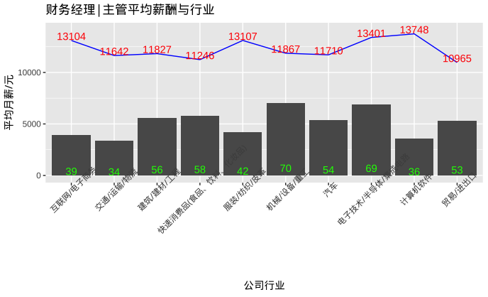

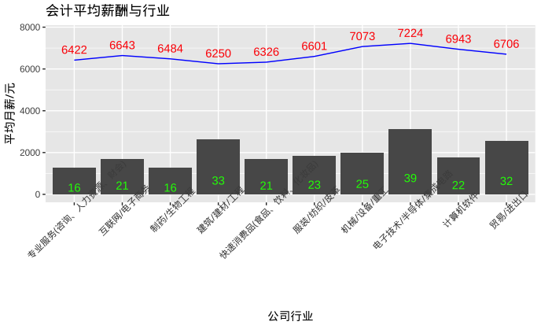

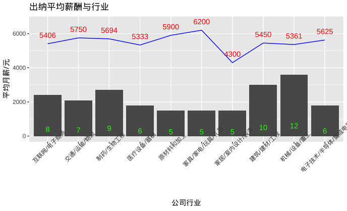

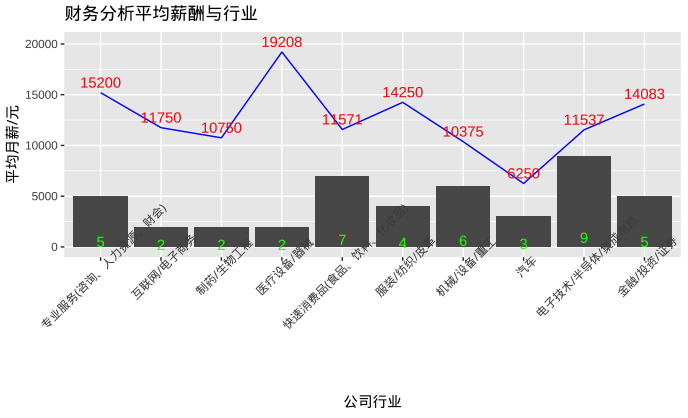

## 福利待遇

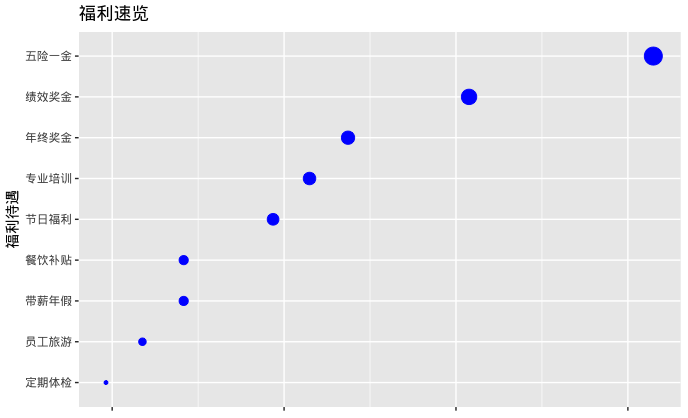
